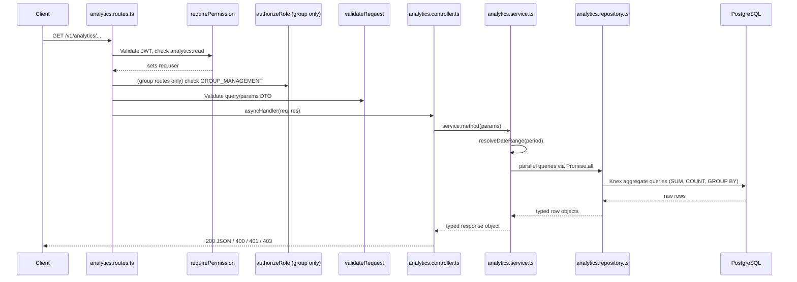

# Analytics Report Design

## Routes

The router is mounted at `/v1/analytics` in `src/routes/routes.ts`.

### Group Management (role: `GROUP_MANAGEMENT`)

| Method | Path                          | Permission       | Role               |
| ------ | ----------------------------- | ---------------- | ------------------ |
| GET    | `/v1/analytics/group/summary` | `analytics:read` | `GROUP_MANAGEMENT` |
| GET    | `/v1/analytics/group/compare` | `analytics:read` | `GROUP_MANAGEMENT` |

### Unit Manager / Unit Staff (role: any authenticated user with `analytics:read`)

| Method | Path                                     | Auth             |
| ------ | ---------------------------------------- | ---------------- |
| GET    | `/v1/analytics/:unitId/kpi`              | `analytics:read` |
| GET    | `/v1/analytics/:unitId/sales-trend`      | `analytics:read` |
| GET    | `/v1/analytics/:unitId/top-menus`        | `analytics:read` |
| GET    | `/v1/analytics/:unitId/payments`         | `analytics:read` |
| GET    | `/v1/analytics/:unitId/inventory-status` | `analytics:read` |
| GET    | `/v1/analytics/:unitId/daily-inventory`  | `analytics:read` |

> **Important:** Static group routes (`/group/summary`, `/group/compare`) are registered **before** the dynamic `/:unitId/*` routes to prevent Express from treating the literal string `"group"` as a `unitId` parameter.

---

## Authorization

Middleware order is **critical**:

```
requirePermission('analytics:read')   ← authenticates JWT, sets req.user, checks permission
authorizeRole(['GROUP_MANAGEMENT'])   ← reads req.user.role (fails with 401 if called before requirePermission)
validateRequest(Dto, 'query'|'params')← validates and coerces query/param values
asyncHandler(controller.method)       ← calls service, returns JSON response
```

`requirePermission` MUST come before `authorizeRole`. Swapping the order causes `authorizeRole` to receive `req.user = undefined` and return 401 even without authentication.

Unit-level routes do **not** restrict by role — any user with `analytics:read` permission and a valid `unitId` can access them.

---

## Period Parameter

All time-bounded endpoints accept a `?period=` query parameter:

| Value     | Range                                     |
| --------- | ----------------------------------------- |
| `today`   | Start of today → now                      |
| `7d`      | Last 7 days rolling → now (default)       |
| `30d`     | Last 30 days rolling → now                |
| `month`   | First day of current calendar month → now |
| `quarter` | 3 months ago → now                        |

`resolveDateRange(period)` and `resolvePreviousDateRange(period)` are exported from `analytics.repository.ts` and used by the service to compute `startDate`/`endDate` as JavaScript `Date` objects.

---

## Data Flow



---

## Method Signatures

### Service (`analytics.service.ts`)

```ts
// Unit-level
async getKpi(unitId: string, period: string): Promise<AnalyticsKpiResponse>
async getSalesTrend(unitId: string, period: string): Promise<AnalyticsSalesTrendResponse>
async getTopMenus(unitId: string, period: string): Promise<AnalyticsTopMenusResponse>
async getRecentPayments(unitId: string): Promise<AnalyticsPaymentsResponse>
async getInventoryStatus(unitId: string): Promise<AnalyticsInventoryStatusResponse>
async getDailyInventory(unitId: string, date: string): Promise<AnalyticsDailyInventoryResponse>

// Group-level
async getGroupSummary(period: string): Promise<AnalyticsGroupSummaryResponse>
async getGroupCompare(unitIds: string[], period: string): Promise<AnalyticsGroupCompareResponse>
```

### Repository interface (`IAnalyticsRepository`)

```ts
// Unit-level
findUnitById(unitId: string): Promise<{ unit_id: string } | null>
getKpiRaw(unitId: string, startDate: Date, endDate: Date): Promise<KpiRow>
getStokKritis(unitId: string): Promise<number>
getSalesTrend(unitId: string, startDate: Date, endDate: Date, period: string): Promise<SalesTrendPoint[]>
getTopMenus(unitId: string, startDate: Date, endDate: Date, limit: number): Promise<TopMenuRow[]>
getRecentPayments(unitId: string, limit: number): Promise<PaymentHistoryRow[]>
getInventoryStatus(unitId: string): Promise<{ lowOrCritical: InventoryStatusRow[]; outOfStock: InventoryStatusRow[] }>
getDailyInventory(unitId: string, date: string): Promise<DailyInventoryRow[]>

// Group-level
getGroupKpiRaw(startDate: Date, endDate: Date): Promise<GroupKpiRaw>
getGroupSalesTrend(startDate: Date, endDate: Date, period: string): Promise<SalesTrendPoint[]>
getGroupTopMenus(startDate: Date, endDate: Date, limit: number): Promise<TopMenuRow[]>
getGroupTotalStokKritis(): Promise<number>
getUnitPerformanceTable(startDate: Date, endDate: Date): Promise<UnitPerformanceRow[]>
getGroupCompare(unitIds: string[], startDate: Date, endDate: Date): Promise<UnitCompareRow[]>
```

---

## Response Shapes

### `GET /v1/analytics/group/summary`

```json
{
  "success": true,
  "statusCode": 200,
  "message": "Berhasil mengambil ringkasan analytics grup",
  "data": {
    "kpi": {
      "total_omzet": 50000000,
      "total_transaksi": 500,
      "rata_rata_order": 100000,
      "selesai": 470,
      "dibatalkan": 30,
      "stok_kritis": 5
    },
    "sales_trend": [
      {
        "label": "Sen",
        "date": "2025-07-14",
        "omzet": 1000000,
        "transaksi": 10
      }
    ],
    "top_menus": [
      {
        "menu_item_id": "uuid",
        "menu_item_name": "Nasi Goreng",
        "category_name": "Makanan",
        "qty_terjual": 120,
        "pendapatan": 3600000
      }
    ],
    "unit_performance": [
      {
        "unit_id": "uuid",
        "unit_name": "Unit Pusat",
        "omzet": 10000000,
        "transaksi": 100,
        "rata_rata_order": 100000,
        "selesai": 95,
        "dibatalkan": 5,
        "stok_kritis": 1
      }
    ]
  }
}
```

### `GET /v1/analytics/group/compare?unitIds=uuid1,uuid2&period=7d`

```json
{
  "success": true,
  "statusCode": 200,
  "message": "Berhasil mengambil data perbandingan unit",
  "data": [
    {
      "unit_id": "uuid1",
      "unit_name": "Unit A",
      "omzet": 5000000,
      "transaksi": 50,
      "rata_rata_order": 100000,
      "selesai": 48,
      "dibatalkan": 2
    },
    {
      "unit_id": "uuid2",
      "unit_name": "Unit B",
      "omzet": 0,
      "transaksi": 0,
      "rata_rata_order": 0,
      "selesai": 0,
      "dibatalkan": 0
    }
  ]
}
```

### `GET /v1/analytics/:unitId/kpi?period=7d`

```json
{
  "success": true,
  "statusCode": 200,
  "message": "Berhasil mengambil data KPI analytics",
  "data": {
    "total_omzet": 10000000,
    "total_transaksi": 100,
    "rata_rata_order": 100000,
    "selesai": 95,
    "dibatalkan": 5,
    "stok_kritis": 2,
    "omzet_growth_pct": 12,
    "transaksi_growth_pct": 8,
    "avg_growth_pct": null
  }
}
```

---

## Edge Cases

| Scenario                                          | Behavior                                                                                                                   |
| ------------------------------------------------- | -------------------------------------------------------------------------------------------------------------------------- |
| Group summary, unit dengan 0 order                | Unit tetap muncul di `unit_performance` dengan semua nilai `0`                                                             |
| `getGroupCompare` dengan `unitIds` kosong         | Service langsung return `data: []` tanpa hit DB                                                                            |
| Unit tidak ditemukan (`/v1/analytics/:unitId/*`)  | Service throw `AppError` dengan `status: 404`                                                                              |
| `rata_rata_order` saat `total_transaksi = 0`      | Diset ke `0` (bukan `Infinity`/`NaN`)                                                                                      |
| `stok_kritis` group                               | Dihitung real-time via `getGroupTotalStokKritis()` (bukan dari KPI raw), menggunakan `min_threshold` dari tabel inventaris |
| KPI growth percentage saat periode sebelumnya = 0 | Return `null` (bukan angka)                                                                                                |
| `unitIds` di group compare                        | Diparse dari query string CSV di controller, diteruskan ke service sebagai `string[]`                                      |

---

## TODO / Backlog

- [ ] **Export PDF** — endpoint untuk mengunduh laporan analytics dalam format PDF (belum diimplementasi)

````

Repository methods use scoped aggregate queries:

```ts
getMetrics(scope): Promise<AnalyticsMetricSummary>
getStatusTransactions(scope): Promise<AnalyticsStatusRow[]>
getTopMenus(scope, limit?): Promise<AnalyticsMenuRow[]>
getRevenueByMenu(scope, limit?): Promise<AnalyticsMenuRow[]>
getRevenueByUnit(scope): Promise<AnalyticsUnitRevenueRow[]>
getTopMenusByUnit(scope, limitPerUnit?): Promise<AnalyticsMenuRow[]>
getCriticalStockUnits(scope): Promise<AnalyticsCriticalStockUnitRow[]>
getInventoryPerformanceByUnit(scope): Promise<AnalyticsInventoryPerformanceRow[]>
getPaymentSummary(scope): Promise<AnalyticsPaymentRow[]>
getPaymentHistory(scope, limit?): Promise<AnalyticsPaymentHistoryRow[]>
getLowStockItems(scope): Promise<AnalyticsInventoryRow[]>
getDailyInventoryUsage(scope): Promise<AnalyticsDailyUsageRow[]>
````

## Response Examples

Group summary:

```json
{
  "success": true,
  "statusCode": 200,
  "message": "Analytics report retrieved successfully",
  "data": {
    "totalRevenue": 12500000,
    "totalTransactions": 240,
    "averageOrderValue": 62500,
    "completedTransactions": 200,
    "cancelledTransactions": 8,
    "bestSellingMenus": [],
    "highestRevenueUnit": null,
    "criticalStockUnits": [],
    "unitPerformanceComparison": []
  }
}
```

Unit report:

```json
{
  "success": true,
  "statusCode": 200,
  "message": "Analytics report retrieved successfully",
  "data": {
    "unit": {
      "unitId": "550e8400-e29b-41d4-a716-446655440000",
      "unitName": "Central Kitchen",
      "location": "Jakarta"
    },
    "totalRevenue": 1000000,
    "totalTransactions": 12,
    "averageOrderValue": 250000,
    "completedTransactions": 4,
    "cancelledTransactions": 2,
    "transactionStatus": {
      "completed": 4,
      "cancelled": 2,
      "pending": 6
    },
    "bestSellingMenus": [],
    "paymentReport": [],
    "inventoryReport": {
      "lowStockItems": [],
      "outOfStockItems": []
    },
    "dailyInventoryUsage": []
  }
}
```

Compare units:

```json
{
  "success": true,
  "statusCode": 200,
  "message": "Analytics report retrieved successfully",
  "data": {
    "comparedUnits": [],
    "selectedMetrics": ["revenue", "transactions"],
    "revenueComparison": [],
    "transactionComparison": [],
    "averageOrderComparison": [],
    "bestSellingMenuComparison": [],
    "inventoryComparison": [],
    "criticalStockComparison": []
  }
}
```

Forbidden:

```json
{
  "success": false,
  "message": "Anda tidak memiliki akses ke resource ini",
  "error": {
    "code": "AUTH_FORBIDDEN",
    "details": "You are not allowed to access this unit report"
  }
}
```

## Suggested Indexes

```sql
CREATE INDEX IF NOT EXISTS idx_orders_unit_ordered_not_deleted
  ON orders (unit_id, ordered_at)
  WHERE deleted_at IS NULL;

CREATE INDEX IF NOT EXISTS idx_orders_status_ordered_not_deleted
  ON orders (order_status_id, ordered_at)
  WHERE deleted_at IS NULL;

CREATE INDEX IF NOT EXISTS idx_order_items_order_not_deleted
  ON order_items (order_id, menu_item_id)
  WHERE deleted_at IS NULL;

CREATE INDEX IF NOT EXISTS idx_payments_order_created_not_deleted
  ON payments (order_id, created_at)
  WHERE deleted_at IS NULL;

CREATE INDEX IF NOT EXISTS idx_inventory_items_units_unit_not_deleted
  ON inventory_items_units (unit_id, inventory_item_id)
  WHERE deleted_at IS NULL;

CREATE INDEX IF NOT EXISTS idx_daily_inventory_realizations_unit_date
  ON daily_inventory_realizations (unit_id, date);
```
