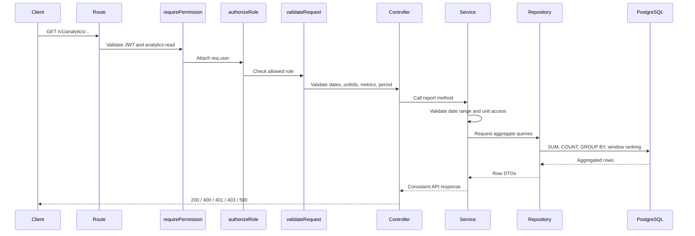

# Analytics Report Design

## Stack

- Framework: Express.js
- Database: PostgreSQL
- Query builder: Knex
- Authentication: JWT
- Authorization: permission check plus role guard

## Folder Structure

- `analytics.routes.ts`: REST routes, authentication, role authorization, request validation.
- `analytics.controller.ts`: Thin HTTP adapter from Express request to service.
- `analytics.service.ts`: Business rules, role defense, unit access defense, response mapping.
- `repositories/analytics.repository.ts`: Aggregation queries.
- `dto/analytics-query.dto.ts`: Query and path validation.
- `utils/analytics-period.ts`: Date range and period helper.
- `__tests__/analytics.service.spec.ts`: Minimal authorization and calculation tests.
- `src/swagger/analytics.swagger.ts`: OpenAPI paths and response examples.

## Routes

The application mounts APIs under `/v1`.

- `GET /v1/analytics/group/summary`
- `GET /v1/analytics/group/units/:unitId`
- `GET /v1/analytics/group/compare-units`
- `GET /v1/analytics/unit/report`

Legacy aliases are kept:

- `GET /v1/analytics/units/:unitId/summary`
- `GET /v1/analytics/my/summary`

## Authorization

The route pipeline follows the existing multi-role pattern in this codebase:

1. `requirePermission('analytics:read')` authenticates JWT and checks permission.
2. `authorizeRole(['GROUP_MANAGEMENT'])` or `authorizeRole(['UNIT_MANAGER'])` narrows the role.
3. Service re-checks the role defensively.
4. Unit Manager unit access is derived from `req.user.units`, not trusted from arbitrary input.

## Data Flow



## Method Signatures

```ts
getGroupSummary(user, query): Promise<AnalyticsReportResponse<GroupSummaryData>>
getGroupUnitReport(user, unitId, query): Promise<AnalyticsReportResponse<UnitReportData>>
compareGroupUnits(user, query): Promise<AnalyticsReportResponse<CompareUnitsData>>
getUnitManagerReport(user, query): Promise<AnalyticsReportResponse<UnitReportData>>
```

Repository methods use scoped aggregate queries:

```ts
getMetrics(scope): Promise<AnalyticsMetricSummary>
getStatusTransactions(scope): Promise<AnalyticsStatusRow[]>
getTopMenus(scope, limit?): Promise<AnalyticsMenuRow[]>
getRevenueByMenu(scope, limit?): Promise<AnalyticsMenuRow[]>
getRevenueByUnit(scope): Promise<AnalyticsUnitRevenueRow[]>
getTopMenusByUnit(scope, limitPerUnit?): Promise<AnalyticsMenuRow[]>
getCriticalStockUnits(scope): Promise<AnalyticsCriticalStockUnitRow[]>
getInventoryPerformanceByUnit(scope): Promise<AnalyticsInventoryPerformanceRow[]>
getPaymentSummary(scope): Promise<AnalyticsPaymentRow[]>
getPaymentHistory(scope, limit?): Promise<AnalyticsPaymentHistoryRow[]>
getLowStockItems(scope): Promise<AnalyticsInventoryRow[]>
getDailyInventoryUsage(scope): Promise<AnalyticsDailyUsageRow[]>
```

## Response Examples

Group summary:

```json
{
  "success": true,
  "statusCode": 200,
  "message": "Analytics report retrieved successfully",
  "data": {
    "totalRevenue": 12500000,
    "totalTransactions": 240,
    "averageOrderValue": 62500,
    "completedTransactions": 200,
    "cancelledTransactions": 8,
    "bestSellingMenus": [],
    "highestRevenueUnit": null,
    "criticalStockUnits": [],
    "unitPerformanceComparison": []
  }
}
```

Unit report:

```json
{
  "success": true,
  "statusCode": 200,
  "message": "Analytics report retrieved successfully",
  "data": {
    "unit": {
      "unitId": "550e8400-e29b-41d4-a716-446655440000",
      "unitName": "Central Kitchen",
      "location": "Jakarta"
    },
    "totalRevenue": 1000000,
    "totalTransactions": 12,
    "averageOrderValue": 250000,
    "completedTransactions": 4,
    "cancelledTransactions": 2,
    "transactionStatus": {
      "completed": 4,
      "cancelled": 2,
      "pending": 6
    },
    "bestSellingMenus": [],
    "paymentReport": [],
    "inventoryReport": {
      "lowStockItems": [],
      "outOfStockItems": []
    },
    "dailyInventoryUsage": []
  }
}
```

Compare units:

```json
{
  "success": true,
  "statusCode": 200,
  "message": "Analytics report retrieved successfully",
  "data": {
    "comparedUnits": [],
    "selectedMetrics": ["revenue", "transactions"],
    "revenueComparison": [],
    "transactionComparison": [],
    "averageOrderComparison": [],
    "bestSellingMenuComparison": [],
    "inventoryComparison": [],
    "criticalStockComparison": []
  }
}
```

Forbidden:

```json
{
  "success": false,
  "message": "Anda tidak memiliki akses ke resource ini",
  "error": {
    "code": "AUTH_FORBIDDEN",
    "details": "You are not allowed to access this unit report"
  }
}
```

## Suggested Indexes

```sql
CREATE INDEX IF NOT EXISTS idx_orders_unit_ordered_not_deleted
  ON orders (unit_id, ordered_at)
  WHERE deleted_at IS NULL;

CREATE INDEX IF NOT EXISTS idx_orders_status_ordered_not_deleted
  ON orders (order_status_id, ordered_at)
  WHERE deleted_at IS NULL;

CREATE INDEX IF NOT EXISTS idx_order_items_order_not_deleted
  ON order_items (order_id, menu_item_id)
  WHERE deleted_at IS NULL;

CREATE INDEX IF NOT EXISTS idx_payments_order_created_not_deleted
  ON payments (order_id, created_at)
  WHERE deleted_at IS NULL;

CREATE INDEX IF NOT EXISTS idx_inventory_items_units_unit_not_deleted
  ON inventory_items_units (unit_id, inventory_item_id)
  WHERE deleted_at IS NULL;

CREATE INDEX IF NOT EXISTS idx_daily_inventory_realizations_unit_date
  ON daily_inventory_realizations (unit_id, date);
```
